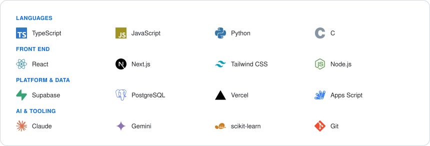
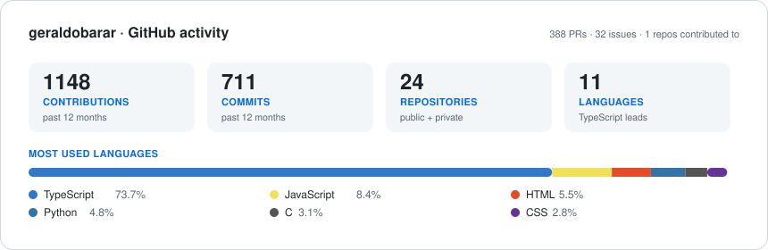

<h1 align="center">Geraldo Baranoski</h1>

  <strong>Full-stack developer</strong> · TypeScript &amp; Next.js · applied AI · process automation 
  Computer Science @ UTFPR — Ponta Grossa, Brazil

  
  
  

---

## What I do

- **Ship production web apps in TypeScript.** Next.js (App Router) + React on the front, Supabase/Postgres with row-level security on the back, deployed on Vercel.
- **Wire LLMs in as a product feature, not a demo.** Natural-language data entry and generated reports — with streaming, token accounting and cost control built in.
- **Automate real business processes.** A single form submit that opens an entire legal case: Drive hierarchy, control spreadsheets, deadlines and the drafted documents.
- **Work below the framework line too.** C, data structures, binary persistence and indexing, plus Python for ML pipelines.

## Selected work

Most of my recent work lives in private repositories. Here is what is inside them.

| Project | What it is | Stack |
| :--- | :--- | :--- |
| **Centro Financeiro** `private` | Personal finance platform: entries by form, AI chat or WhatsApp; recurring bills; an investment portfolio with automatic quotes and dividends; AI-written weekly reports. Per-user data isolation via RLS. | Next.js 16 · React 19 · Supabase · Tailwind 4 design system · Vercel AI SDK + AI Gateway · Cron Jobs · Vitest |
| **LegalLawAutomation** `private` | End-to-end case opening for a law firm, driven by one form submission: idempotent Drive folder hierarchy keyed by CPF, control and deadline spreadsheets, case summary and the legal documents for each practice area. In production, v25. | Google Apps Script (V8) · Drive / Sheets / Docs APIs |
| **LexIO** `private` | Legal-tech assistant built around Gemini, with a React SPA front end and an Express service behind it. | React · Vite · Express · `@google/genai` |
| **Mixtape** `private` | Multiplayer music party game of bluffing and deduction, with synchronised game state across players. | Next.js · Supabase Realtime |

## Public repositories

| Repository | What it shows |
| :--- | :--- |
| [**Blockchain-Simulator**](https://github.com/geraldobarar/Blockchain-Simulator) | Simplified Bitcoin-style chain in C: SHA-256 proof-of-work, 30,000 blocks persisted to a binary file in 16-block batches, and in-memory indexes for lookups by address and nonce without scanning the file. |
| [**Final-Project-AI-ML-**](https://github.com/geraldobarar/Final-Project-AI-ML-) | Predicting university dropout from academic and socioeconomic data — the full pipeline, from ETL and EDA through feature engineering to the models. Python, pandas, scikit-learn. |
| [**AI-Project**](https://github.com/geraldobarar/AI-Project) | *Supermarket Showdown* — an educational game where you play a shopping duel against a search agent, used to contrast A\* against greedy search. |
| [**MSA---AC-7**](https://github.com/geraldobarar/MSA---AC-7) | Q-Learning agent that learns, by trial and error, which box to allocate each object to in order to maximise cumulative reward. Built on MASPY. |
| [**DutchBlitz**](https://github.com/geraldobarar/DutchBlitz) | Scoreboard for the card game — a small, finished front end. |
| [**UTFPR-1st-Year-**](https://github.com/geraldobarar/UTFPR-1st-Year-) · [**C-Studies**](https://github.com/geraldobarar/C-Studies) | Coursework: C fundamentals and the first steps into object orientation. |

## Tech

  <picture>
    <source media="(prefers-color-scheme: dark)" srcset="./assets/tech-dark.svg">
    
  </picture>

## Activity

  <picture>
    <source media="(prefers-color-scheme: dark)" srcset="./assets/stats-dark.svg">
    
  </picture>

  <picture>
    <source media="(prefers-color-scheme: dark)" srcset="https://raw.githubusercontent.com/geraldobarar/geraldobarar/output/github-contribution-grid-snake-dark.svg">
    
  </picture>

Every card on this page is generated by the scripts in <a href="./scripts"><code>scripts/</code></a> and committed by GitHub Actions — no third-party badge or stats service is involved, so nothing here breaks when one goes down.
